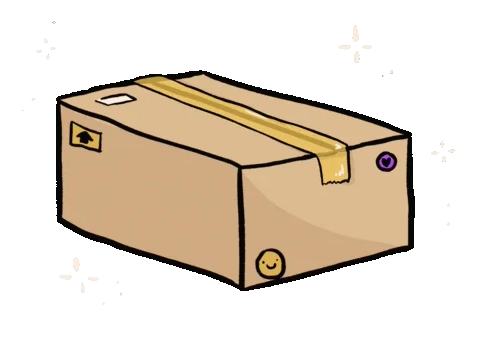

<div align='center'>
    
    <h1 align='center'>mondial-relay</h1>
</div>

<div align="center">
    
    
</div>
 
<div align="center">
    
</div>
 
<div align="center">
    <a href='https://www.google.com/url?sa=t&rct=j&q=&esrc=s&source=web&cd=&cad=rja&uact=8&ved=2ahUKEwiFmq2GueKEAxXf_7sIHcONCvcQFnoECBEQAQ&url=https%3A%2F%2Ffr.linkedin.com%2Fin%2Ftom-blanchet&usg=AOvVaw2NyolXUeo7ja8PpF4VNmHt&opi=89978449'>
    
    </a>
</div>

```
A package that allows you to interact with MondialRelay's API using Typescript.
```

I wanted to use a package that allows me to interact with MondialRelay without having to setup a Prestashop or any ecommerce module.

# Install

```bash
npm install mondial-relay
```

# Run the demo

Simply run the following command to run a set of predefined example requests:

```bash
npm run examples
```

# Support

You can create a PR on this project and I will review it.
If you prefer, you can contact me on Linkedin or by email (contact@tomblanchet.fr).

# Credit

This project is a fork of [this original one](https://github.com/nooqta/mondial-relay-api). Thank you for your work !

# Features

Here is an exhaustive list of the actions you can trigger using this library:

- `getLabels`: get labels
- `createLabel`: create a label
- `getTracking`: get the current tracking for a package
- `getStatMessage`: get statistic message
- `searchZipCodes`: search relay points by zip code
- `searchPointsRelais`: search relay points by zip code

# How to use

```typescript
import { getLabels } from '@frontBOI/mondial-relay'

async function execute() {
  const labels = await getLabels()
  console.log(labels)
}

execute()
```
